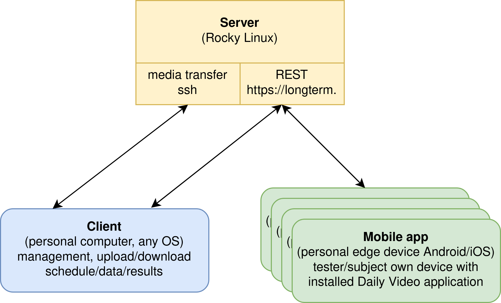

# LTS (Long Term Study) platform

The "Long Term Study" platform is designed to measure and understand user behavior through longitudinal studies, which track the same subjects over a period of time. It was developed as a part of the TUFIQoE project focusing on Quality of Experience (QoE). The platform includes features to control video quality, deliver customizable questions, manage schedules, provide feedback, track device position and collect results in real-time. It is user-friendly and compatible with both Android and iOS devices, allowing participants to use their own phones for the study. This platform greatly contributes to understanding the longitudinal aspects of QoE, providing an ecologically-valid evaluation of users' interaction with video services.

It consists of three major elements:
* **[Server](./server)**: repository containing all components and instructions on how to build your own long-term server. See `server` folder.
* **[Client](./client_scripts)**: the `client_scripts` folder contains Python scripts for easy experiment maintenance. Create and upload user schedules, upload content, download results, monitor user activity, and some other scripts for work automation.
* [Client tests](./client_tests): the `client_tests` folder contains scripts and data for testing various scenario related with client side. 
* Backup: the `client_scripts` folder contains Python scripts and instructions for additional offsite backup. Data is critical, it is good to have an extra backup.
* **[Mobile application](./mobile_app)**: the `mobile_app` folder contains everything you need to create and deploy a mobile application for subjects. Both for Android and iOS.

# Data processing

This document describe the way data are processed by the system. It also describes issues related with processing sensitive data (GDPR).

Connections between components and information interchanging are presented on the following diagram:




## Server

A single instance of a typical production server (or virtual machine) with [Rocky Linux OS](https://rockylinux.org/pl/) - an enterprise grade OS based and compatible with an Red Hat Enterprise Linux.

It is used for interchange information between client and mobile applications. It store video data, schedules for mobile application and result from mobile application.

Server does not contain any personal data. Users are identified by individual token. Token is generated with hashing function SHA256 from user name, surname, phone number and salt.

Server business logic (application) has been written with [django](https://www.djangoproject.com/) framework.

Server interfaces:
* publicly available REST interface through (https://) - require individual token for communication
* publicly available management interface (https:// - require admin login/password)
* ssh interface for management and data (video) downloading/uploading, used only for `client`-`server`communication, requires VPN to private AGH subnet, login only through ssh key (login/password forbidden)

Server use SSL certificate issued by [Let's Encrypt](https://letsencrypt.org/) and renewed automatically every ~3 months.

## Client

It is a personal computer (an OS) of the person supervising the LTS experiment. A bunch of python scripts are used for uploading information to the server and download results of individual tester/subject from the server. 

Client upload video and experiment schedule for an individual tester/subject. Client download experiment results (raw data) from an individual tester/subject. All communication is performed with server. There is no direct communication between client and tester/subject (it's mobile application).

Tester/subject is identify by it's individual token. Any authorization/identification is performed by this token. Tester's name/surrname/phone_number are not transmitted in between any of the LTS components (client, server, mobile app).

## Mobile application (longterm app)

It is a mobile application for Android and iOS written in [React Native](https://reactnative.dev/) framework. It is executed on a personal tester/subject mobile device. It is uploaded and configured on that device by a person supervising the LTS experiment.

During an application configuration, the tester/subject name, surname and telephone number are entered to the application, next token is calculated and than, first attempt to server communication is performed. Communication with server use https:// protocol only. Authorization is done by previously generated token.

Mobile application download schedule and video from the server, presents (once a day) video to the user and (optionally) ask user about already shown video clip. During presentation the application record telemetry (description below) and then sent it to the server (client can download it for processing).

The application connect only to LTS server. No other external services are used.

### Data

Below the description of data recorded during use of the application are enumerated. All recorded data are sent to the server immediately or as soon as possible in case of lack of connectivity. Then recorded data are removed from the user device.  

Type of data recorder during use of the application:
- device information (OS type, OS name, OS version, platform api level, device brand, device model, manufacturer, device year class, memory free, memory total),
- during video playing, every 250ms the following data are recorded: play/pause information, screen brightness, fullscreen status, phone orientation, gyroscope (X,Y,Z) value, accelerometer (X,Y,Z) value,
- video duration,
- user answers (response) to the questions on the form, data types depends on the form, it could be closed form (chose one of presented answer), could be number (MOS test) or free form (user enter text),
- optional user feedback as a text entered by the user,
- timestamps related to user timezone: start/stop/pause video, beginning/end of each presented form

## Token algorithm

Token identify user. It is generated with the following code:
```python
def hash(name: str, surname: str, phone: str) -> str:
    salt = '.........'
    txt = f'{name}{surname}{phone}{salt}'.encode('UTF-8')
    return hashlib.sha256(txt).hexdigest()
```

## Usecaces

Installation:
1. In the beginning of the experiment, tester/subject need to bring his/her own devices to the LTS experiment supervisor. It install longterm application, enter name/surname/phone number and test if it's working correctly.

Typical use:
1. Client (supervisor of the LTS experiment) prepare video files and schedule for the next (typically) several days. Schedule is written in a JSON text file. Client use script for uploading video and schedule to the server. The schedule is linked with the user only by the individual token (no name, surname and phone numer are sent to the server).
2. Tester/subject use it's application once a day. When application is started by the user (it is not started automatically) it ask a server for new schedules and videos. They are downloaded from the server to the mobile devices (usually prefetching for 3 consecutive days). Then video is presented, user watch it and then answer to (optional) questions.
3. Client download results from the server. It can choose individual user (by it's token), group of users or all. It can choose results from particular day, range, or all data. Downloaded results are not removed from the server.

# Docs:
A good starting point for understanding the project is to read the publication related to Long Term Study (see last section of this document). The [doc](./doc) folder contains additional technical documentation for the project:
- [README_deployment.md](./doc/README_deployment.md) - instruction for deployment of the server from scratch
- [README_messages.md](./doc/README_messages.md) - description of messages exchanged between client, server and mobile application
- [README_overwriting_rules.md](./doc/README_overwriting_rules.md) - description of rules for overwriting `schedule.json` - a specific cases how schedule is overwritten by new schedule sent to the server
- [json-templates/](./doc/json-templates/) - templates of JSON files used for communication between client, server and mobile application
 

# TODO:

This section is for TODOs and ideas for future development.
- [ ] Unit tests for upload scripts and various scenarios.
- [ ] During upload videos, check if video is not already on the server (by name). It is expected that media files have unique names.
- [ ] Test more forms of the Qualtrics type.
- [ ] `user_feedback` is incomplete (2023-06-19), issue [backend #82] - endpoint returns first feedback. Now postprocessing is done by `download-results.py` script, single feedback is removed and list of feedback is added.
- [ ] What if device info will change during experiment? It is possible that user will change smartphone during the experiment (1-2 years of experiment per user!) and application will be installed from backup without informing experimentator. It is possible to detect since the device info is gathered each time when the application prepare data for sending.
- [ ] Add support for start/stop date in schedule downloading via REST: GET:/api/users/
- [ ] Implement different access levels of tokens (e.g. admin, user, tester, etc.).

# CREDITS
All work was done within the TUFIQoE experiment at [AGH University of Science and Technology](https://www.agh.edu.pl/en/) in Kraków, Poland. The team members are:
- **Lucjan Janowski** - product owner, concepts
- **Jarosław Bułat** - project leader, concepts, client scripts, testing, documentation. contact: [kwant@agh.edu.pl](mailto:kwant@agh.edu.pl), [WWW](https://home.agh.edu.pl/~kwant/), [linkedin](https://www.linkedin.com/in/jaros%C5%82aw-bu%C5%82at-30a9b191/), treat me as a **contact person** for this project
- **Rafał Figlus** - mobile app
- **Szymon Cader** - server
- **Natalia Cieplińska, Gabriela Wielgus** - experiment leaders
- **Ewa Mazurkiewicz, Karolina Stępień, Klaudia Braś** - UX/UI design


# LICENSE
Entire project is licensed under [MIT license](LICENSE). Authors of individual components (eg. scripts files) are listed in the header of the file.


# CITATION
If you reference or use **LST platform** in your research, please cite:

Jarosław Bułat, Natalia Cieplińska, Rafał Figlus, Lucjan Janowski, "Daily Video: A tool for quality of experience (QoE) in long-term context research," SoftwareX, Volume 25, 2024.

@article{BULAT2024101637,
title = {Daily Video: A tool for quality of experience (QoE) in long-term context research},
journal = {SoftwareX},
volume = {25},
pages = {101637},
year = {2024},
issn = {2352-7110},
doi = {https://doi.org/10.1016/j.softx.2024.101637},
url = {https://www.sciencedirect.com/science/article/pii/S2352711024000086},
author = {Jarosław Bułat and Natalia Cieplińska and Rafał Figlus and Lucjan Janowski},
}

# Acknowledgments

The software development leading to this repository has received funding from the Norwegian Financial Mechanism 2014-2021 under project 2019/34/H/ST6/00599.
